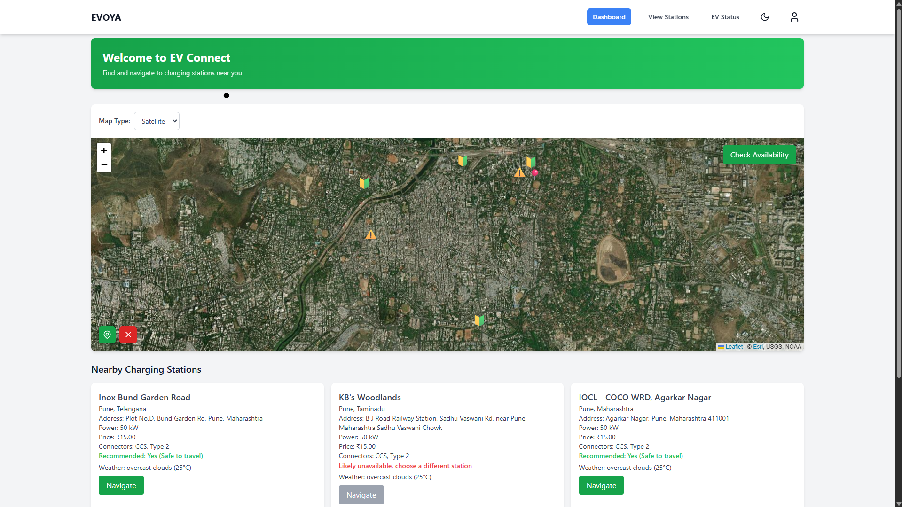
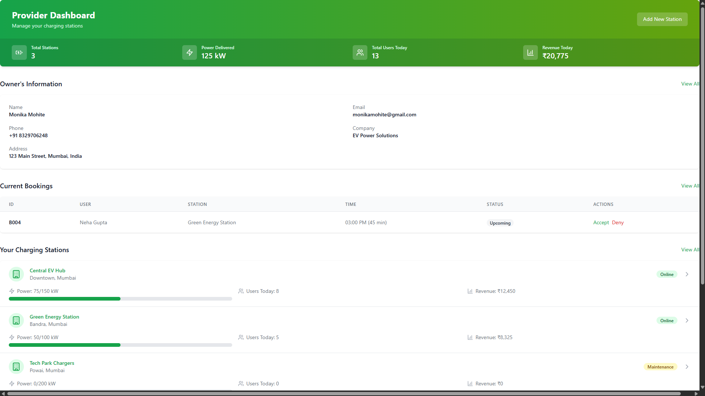
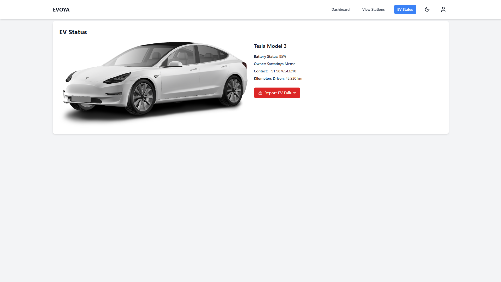

  

  ⚡ A smart and sustainable way to manage EV charging stations  
  👨‍💻 Developed by Team EVOYA 

---

## 🧠 Vision

> The electric vehicle (EV) industry is booming — but charging infrastructure is struggling to keep up.  
This project introduces a **smart, scalable EV charging solution** to tackle the most pressing challenges faced by EV users and operators.

✨ We aim to deliver:

- 🔁 **Intelligent Scheduling** — minimize wait time, maximize efficiency.
- 📡 **Real-time Monitoring** — see what’s happening at any station, anytime.
- ⚡ **AI-Based Load Balancing** — smart power distribution.
- 🎯 **Clean, User-Centric Interfaces** — for users and admins alike.

---

## 🧩 The Problem We're Solving

| ❌ Current Issues                        | ✅ Our Solution                        |
|----------------------------------------|----------------------------------------|
| ❌ No real-time availability tracking   | ✅ Live station monitoring              |
| ❌ No pre-booking option                | ✅ Smart slot booking                   |
| ❌ Poor energy management               | ✅ AI-powered load distribution         |
| ❌ Clunky user experience               | ✅ Sleek, intuitive UI                  |

---

## 🔐 Key Features

- 👥 **User Registration & Login**
- 📅 **Advanced Slot Booking System**
- 🗺️ **Interactive Charging Station Map**
- 📊 **Admin Dashboard** with full analytics
- 🔌 **Live Power Monitoring**
- 🤖 **AI-based Demand Prediction**
- 📱 **Responsive UI for all devices**

---

## 🧱 Tech Stack

| Layer         | Technologies Used                           |
|---------------|----------------------------------------------|
| 🌐 Frontend   | `React.js`, `Tailwind CSS`                  |
| 🧠 AI / ML    | `Scikit-learn` (KNN, Clustering)            |
| 🔧 Backend    | `Flask (Python)`, `Node.js`, `Express.js`   |
| 🗃️ Database   | `MongoDB`                                   |
| 🌐 APIs       | `REST APIs`, `WebSockets`                   |
| 🚀 DevOps     | `GitHub`, `Vercel` / `Render` / `Railway`   |

---

## 👨‍💻 Meet the Team

| Name              | Role |
|-------------------|------|
| 👩‍💻 Sarvadnya Mense   | Developer |
| 🧑‍💻 Atharva Patil     | Developer |
| 👨‍💻 Arya Khobragade   | Developer |
| 👨‍💻 Aaryan Mane       | Developer |
| 👩‍💻 Monika Mohite     | Developer |
| 👩‍💻 Himani Salunkhe   | Developer |

---

## 🖼️ Prototype Screenshots

# Web Interface

### 📅 User Dashboard

> Reserve your slot in advance by selecting location, date, and time.

---

### Provider Dasboard
<h2 align="center"> Dashboard Snapshots</h2>

<table align="center">
  <tr>
    <td align="center">
      
       
      User Dashboard
    </td>
    <td align="center">
      
       
      Provider Dashboard
    </td>
  </tr>
  <tr>
    <td align="center">
      
       
      Navigation Panel
    </td>
    <td align="center">
      
       
      Charging History
    </td>
  </tr>
</table>

> Analytics, revenue insights, and load monitoring — all in one place.

---

### ⚡ Live Power Monitoring

> Track current consumption and station status live.

---

## 🚀 Future Roadmap

- 🔐 OTP / Biometric-based Login
- ☀️ Solar Energy Integration
- 📱 Dedicated Android / iOS App
- 🧾 Smart Billing & Invoicing
- 📈 Predictive Analytics for Demand Forecasting

---

